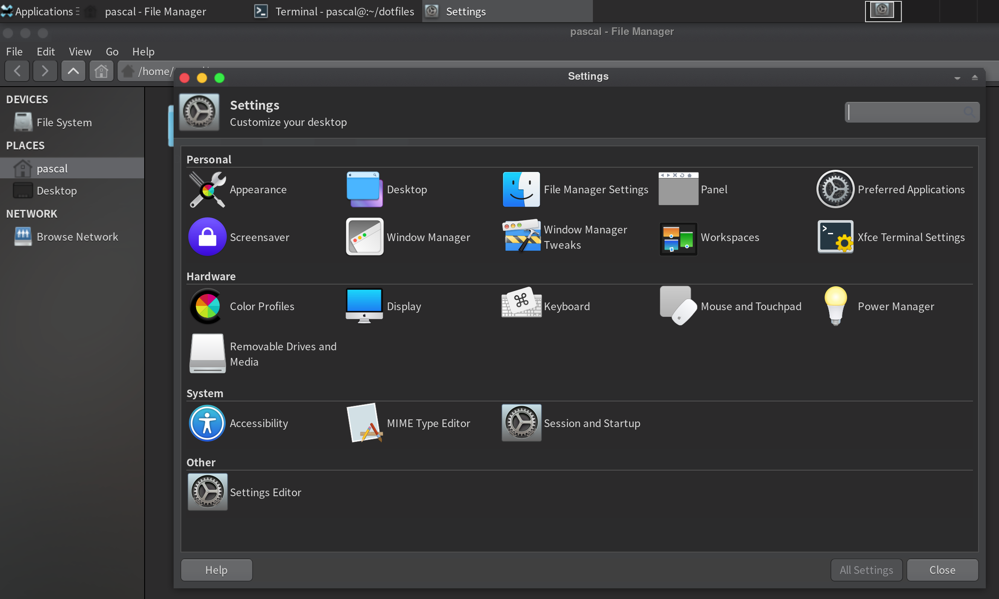
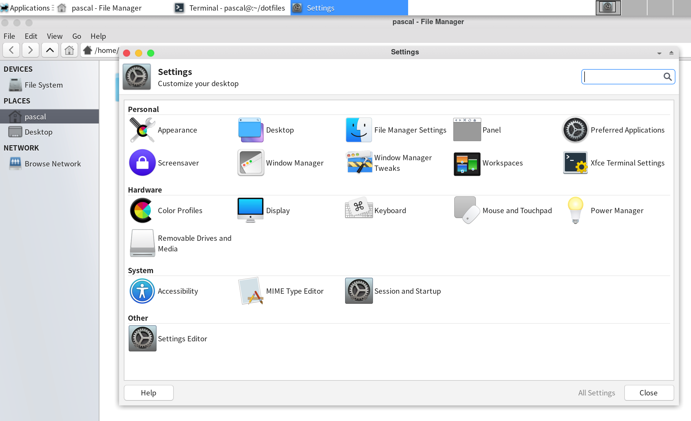

# My dotfiles

## Themes

* OSX-Light/OSX-Dark: https://github.com/paullinuxthemer/McOS-MJV-XFCE-Edition

## Icons

* La-Capitaine: https://github.com/keeferrourke/la-capitaine-icon-theme
* Os-Catalina: https://github.com/zayronxio/Os-Catalina-icons

## Fonts

* Nerd patched fonts: https://github.com/40huo/Patched-Fonts.git
   * camingo-code
   * operator-mono-nerd-font
   * sf-mono-nerd-font

## VNC

Use xfce4 as desktop.

## Firefox

* Theme from: https://github.com/vinceliuice/WhiteSur-gtk-theme
